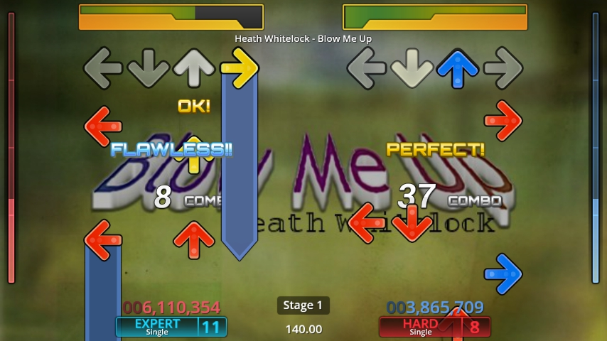
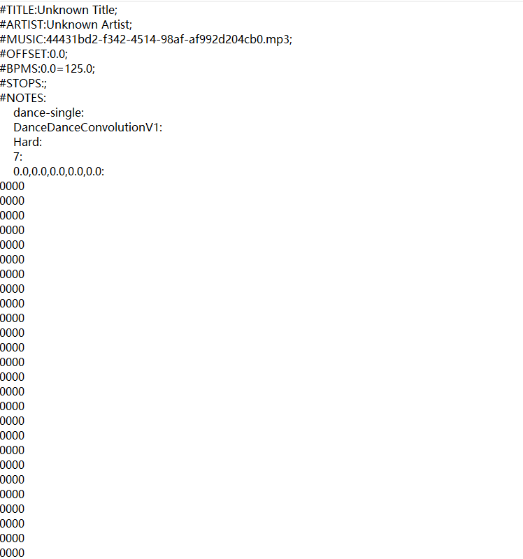
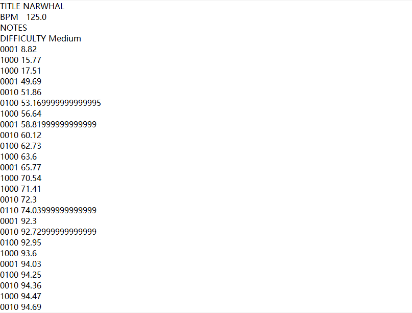
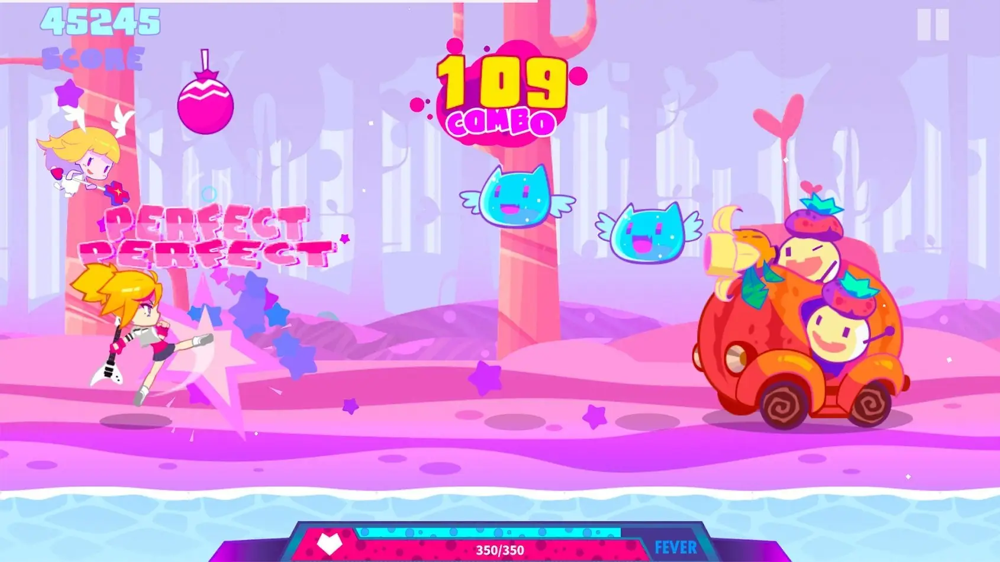
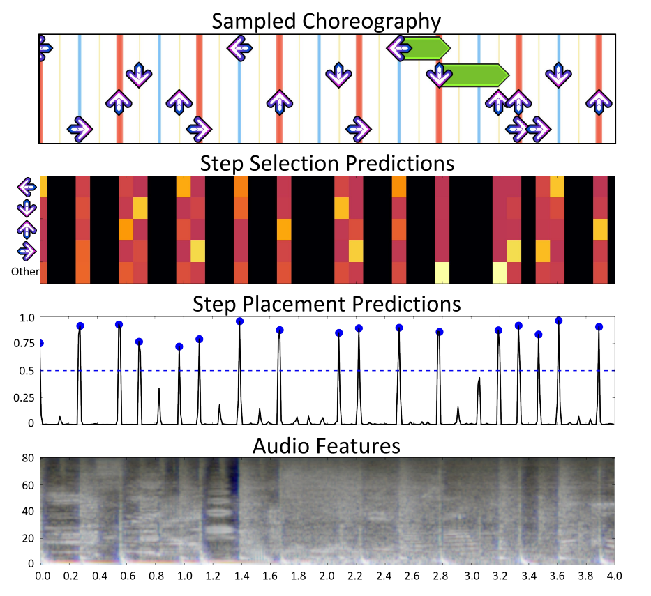
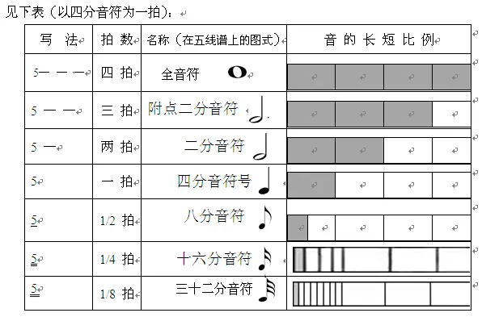

# 一起来做音游

环境：`Unity`，`Python`



## 说在前面

从最早的`跳舞机`，`太鼓达人`，到现在的 `Muse Dash`，音游蓬勃发展。虽然其形式千变万化，但是始终离不开其核心——**谱面**(chart)。

谱面有多种表现形式，像跳舞机那样，只需要将音符和↑、↓、←、→这四个方向对应起来，而对于 `Muse dash` 这样更为复杂的音游，谱面需要更加丰富的表现形式。

下图为 `Stepmania` 的游戏截图：



## 如何定义谱面？

实际上，前者，以 [`Stepmania`](https://github.com/stepmania/stepmania)为例，其谱面对应一个[.sm](https://github.com/stepmania/stepmania/wiki/sm)格式的文件，该文件的形式如下所示：



以 `#` 开头的行描述了诸如 `BPM(beat per minute)` 等必要属性，最关键的内容在于 `#NOTES` 后面紧跟着的内容，它描述了音符和四个方向的对应关系。

上面的文件看起来还不是很友好？没关系，我找到了一个[可用的脚本](https://github.com/jhaco/SMFile_Parser)，可以把 `.sm` 文件变为如下格式：



`NOTES` 和方向的对应关系变简洁了（左边是**四个方向**，右边是**音符出现的时间**）。

是的，有了这个文件，稍加修改，就可以拿来作为你的音游的谱面了！

但是，你会发现，这种谱面文件的表现力有限，对于 `Muse dash` 这种较为丰富的音游，它可不止这四种情况，它更加复杂（包括 BOSS 连击这种），而且，每次击打都会对应一个 `key音`（即击打音效）。`sm` 格式是难以满足这种需求的。



所以 `Muse dash` 使用的是一种叫做 `BMS(Be-Music Source)` 的格式：

```
*---------------------- HEADER FIELD
#PLAYER 1
#GENRE Sample
#TITLE Sample
#ARTIST Sample
#BPM 120
#PLAYLEVEL 5
#TOTAL 100
#RANK 2
#bmp00 miss.bmp
#bmp01 1.bmp
#wav01 1.wav
*---------------------- MAIN DATA FIELD
#00111:01010101
#00211:0101010001010100
```

关于这种格式的详细说明，由于篇幅有限，请看[这里](http://www.charatsoft.com/develop/otogema/page/04bms/bms.htm)。

由于我们要做的是**简单**的音游，所以我们使用跳舞机这种格式就差不多了。

## 我们要自己写谱面吗？

如果你是**音乐大牛**且你是**肝帝**，注意是**且**（and），你可以全部自己写。但是人，作为高等动物，要学会使用工具，这个工具就是 **AI**。

如果你有一定人工智能知识和经验，你就应该能想到将音乐转变为谱面实际上就是一个 **Seq2Seq** 的问题，而这方面的研究已经很成熟了。

事实正式如此，有大佬在 Github 上开源了一个名为 **ddc(Dance Dance Convolution)** 的模型，能够将输入的音源转成我们前面提到的 `sm` 格式。

项目网址：https://github.com/chrisdonahue/ddc

论文网址：https://arxiv.org/pdf/1703.06891v3.pdf



你可以访问 https://ddc.chrisdonahue.com/ 在线生成，也可以使用 docker 在本地部署生成（访问http://localhost:8080）：

```
docker run -it -p 8080:80 chrisdonahue/ddc:latest
```

亲测，这个模型非常有效。

## 说在最后

当然你还需要有一点最基本的音乐常识，比如：

+ 1 节 = 4 拍 = 一个全音符 = 4 个四分音符
+ n 分音符 = 1/n 全音符


